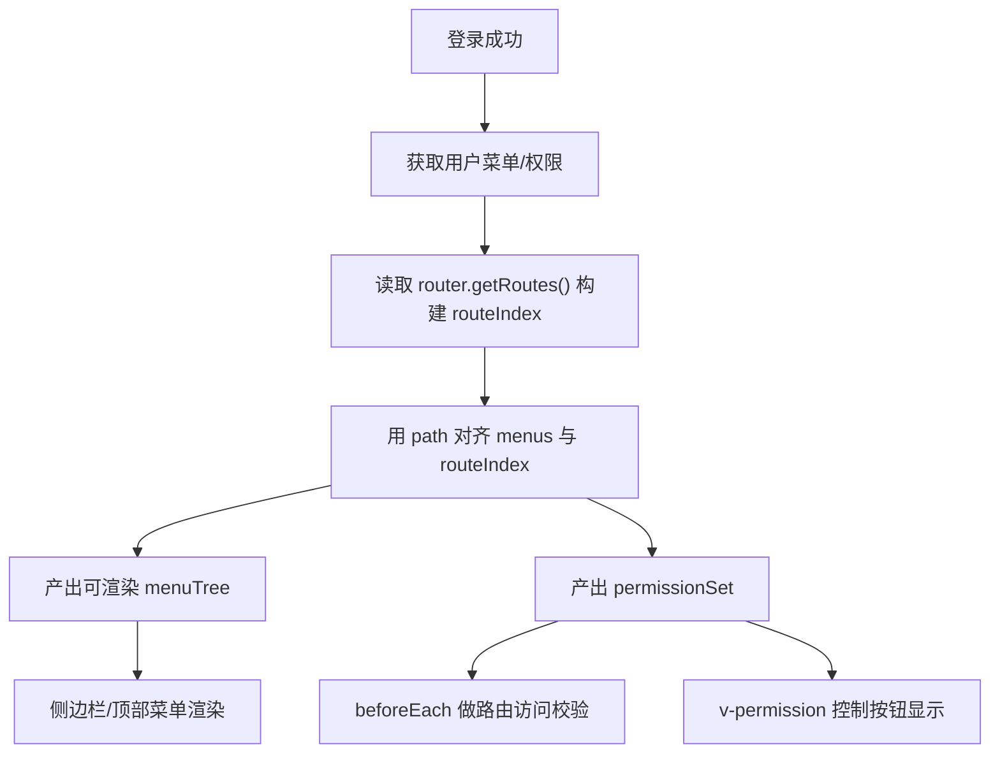

# 多布局多应用 Admin 菜单权限架构方案（基于文件路由）

## 1. 背景与目标

当前项目使用 `vue-router/auto-routes` 基于文件系统生成路由，并通过 `layout` 插件按路由前缀自动匹配布局（例如 `/admin/**`）。

你的目标是：

1. 基于“前端文件路由 + 后端菜单数据”生成统一菜单树。
2. 同一套规则同时用于：路由访问权限、菜单可见性、按钮权限。
3. 兼容多应用（多前缀）和多布局，不把权限逻辑耦合在某个布局组件中。

---

## 2. 结论（可行性）

可行，且建议采用 **“前端路由做能力基线，后端菜单做展示与授权控制”** 的混合模型：

1. 前端路由负责“页面真实存在性”和基础元信息（name/path/layout/meta）。
2. 后端菜单负责“当前用户可见哪些菜单、显示名称/排序/icon、按钮权限点”。
3. 前端在登录后执行一次“路由索引 + 菜单对齐 + 权限集构建”，产出最终菜单和权限集合。

这样可以避免两类常见问题：

1. 纯前端菜单：无法按用户动态收敛。
2. 纯后端路由：前端缺少类型与静态校验，容易出现后端配置指向不存在页面。

---

## 3. 访问策略模型（替代 `noAuth`）

你提的场景本质上是“菜单驱动 + 路由扩展”：

1. 有些页面在菜单中，权限直接来自菜单。
2. 有些页面不在菜单中，但权限要和某个菜单一致（详情页、编辑页）。
3. 有些页面只要求登录，不要求菜单权限。
4. 少量页面完全公开。

建议统一收敛为 `meta.access = { mode, from, path }`：

1. `access.mode = 'menu'`（默认）  
   含义：权限由当前路由对应菜单决定（基于 path 匹配）。
2. `access.mode = 'inherit'`  
   含义：当前路由不走自身菜单权限，继承 `access.from` 指定菜单的权限。
3. `access.mode = 'login'`  
   含义：只要求登录，不要求菜单权限（你之前 `noAuth=true` 更接近这个）。
4. `access.mode = 'public'`  
   含义：完全公开（不登录也可访问，例如公开页）。
5. `access.path`（可选）  
   含义：菜单匹配锚点；默认用规范化 `route.path`，动态路由建议显式填写。

```ts
type AccessMode = 'menu' | 'inherit' | 'login' | 'public'

definePage({
  meta: {
    access: {
      mode: 'inherit',
      from: '/user', // 继承哪个菜单路径的权限
      path: '/user', // 可选：菜单匹配锚点
    },
    menu: false, // 是否在菜单显示
  },
})
```

命名建议（结论）：

1. 不再使用 `noAuth`。
2. 使用 `access.mode` 表达访问级别。
3. 使用 `access.from` 表达“权限跟随某菜单”。
4. 使用 `access.path` 处理动态路由的匹配锚点。

---

## 4. 后端返回结构建议

建议后端拆成两部分：

1. `menus`: 决定导航结构（树）。
2. `permissions`: 决定按钮/操作点。
3. 菜单节点里同时包含“匹配路径”和“跳转信息”。

示例：

```json
{
  "menus": [
    {
      "id": "m_admin",
      "parentId": null,
      "app": "admin",
      "title": "管理台",
      "icon": "dashboard",
      "type": "menu",
      "path": "/admin",
      "order": 1,
      "hidden": false
    },
    {
      "id": "m_user",
      "parentId": "m_admin",
      "app": "admin",
      "title": "用户管理",
      "icon": "user",
      "type": "menu",
      "path": "/user",
      "order": 10,
      "hidden": false
    }
  ],
  "permissions": [
    "user:create",
    "user:edit",
    "user:delete"
  ]
}
```

约束建议：

1. `path` 用于菜单权限匹配（建议规范化后入库，如去尾斜杠）。
2. `path`（或 `name + params`）用于菜单点击跳转。
3. `type=button` 节点不进菜单树，只进权限集合。
4. 支持 `app` 字段，便于多应用场景下按前缀拆分菜单。

### 4.1 为什么以 `path` 作为菜单权限主依据

1. 与“菜单即权限”模型一致，后端配置和前端守卫一致性更高。
2. 用户拿到哪些菜单，本质上就拿到哪些 `path` 访问权。
3. 结合 `access.from/access.path` 可以覆盖“不在菜单但受控”的页面。

推荐菜单跳转字段：

1. 静态页面：`path: '/user'`
2. 动态页面：`name: 'UserDetail', params: { id: '1001' }`
3. 外链页面：`external: 'https://xxx.com'`

---

## 5. 前端核心流程



### 5.1 路由索引构建

从 `router.getRoutes()` 生成 `Map<normalizedPath, RouteRecordRaw>`，过滤：

1. `meta.isLayout === true`（布局包装路由）。
2. 404、登录等公共路由（按白名单保留）。
3. 明确 `meta.menu === false` 的页面。
4. 读取页面 `meta.access.mode/from/path` 作为守卫策略输入。

### 5.2 菜单对齐与修正

对每个后端菜单节点：

1. 菜单 `path` 规范化后生成 `menuPathSet`（权限判定来源）。
2. 找不到对应前端路由时可保留为外链/占位，或按策略丢弃并告警。
3. 命中后合并元数据（优先级建议：后端展示字段 > 前端默认字段）。
4. 优先使用后端传入的 `path/name+params` 作为点击目标；缺失时可由命中的路由记录反推。
5. `hidden=true` 仅影响菜单显示，不影响路由可访问（由守卫策略决定）。

### 5.3 守卫统一

`beforeEach` 建议按访问模式判定：

1. `access.mode=public` -> 直接放行。
2. `access.mode=login` -> 仅校验登录态。
3. `access.mode=menu` -> 校验 `targetPath` 是否在 `menuPathSet`。
4. `access.mode=inherit` -> 校验 `access.from` 是否在 `menuPathSet`。
5. 不通过则跳转 `403` 或首个可访问页。

---

## 6. 动态路由菜单策略（重点）

像 `/test/:form/:id` 这类“必填参数路由”不适合作为直接菜单项。建议规则：

1. `meta.menu = false`：默认不出现在菜单。
2. 需要展示时，菜单应指向“可落地入口路由”（例如 `/test/:form`）并提供默认参数。
3. 如果后端必须下发动态路由菜单，则菜单节点需附带 `name + params`（或完整 `path`），前端用 `router.resolve(...)` 生成可跳转地址。
4. 动态路由若参与菜单权限匹配，建议声明 `meta.access.path`（如 `/user`）或使用 `access.mode='inherit' + access.from='/user'`。

---

## 7. 多布局多应用下的分层建议

按你当前插件能力，建议按路由第一段作为 `appKey`（`admin/home/...`）：

1. 权限数据可按 `appKey` 分桶缓存（如 `permissionByApp.admin`）。
2. 菜单渲染层按当前 app 读取对应菜单树。
3. 布局选择继续由现有 `meta.layout` + `routePrefix` 规则处理，不与权限逻辑耦合。

---

## 8. 落地到当前项目的建议改造点

建议新增/调整：

1. `src/stores/permission.ts`
2. `src/router/route-index.ts`
3. `src/router/guard/auth.ts`（接入菜单/权限加载与访问校验）
4. `src/composables/permission.ts`（`hasPermission`、`canAccessRoute`）
5. `src/directives/permission.ts`（可选，按钮级控制）

建议在页面里补齐最少元信息（渐进式）：

```ts
definePage({
  meta: {
    title: '用户管理',
    access: {
      mode: 'menu',
      // 仅在动态路由或继承场景需要
      path: '/user',
    },
    menu: true,
  },
})
```

---

## 9. 迁移顺序（低风险）

1. 第一步：只做“菜单渲染过滤”，不拦截路由（先验证数据对齐）。
2. 第二步：启用路由守卫拦截，未授权跳转 `403`。
3. 第三步：接入按钮权限点（`v-permission`）。
4. 第四步：清理历史硬编码菜单。

---

## 10. 验收清单

1. 后端返回不存在的菜单 `path`（且非外链）时，页面不崩溃，且有告警日志。
2. 同一账号刷新后菜单结构稳定，不出现闪烁跳转。
3. 未授权用户直接输入 URL 无法进入受限页面。
4. 切换应用前缀（如 `/admin` -> `/home`）时菜单与权限正确隔离。
5. 动态参数路由不会生成不可点击的“死菜单”。
6. `access.mode='inherit'` 页面在不展示菜单时，仍能正确复用目标菜单权限。
7. `access.mode='login'` 页面在无菜单授权时可访问，但未登录不可访问。
