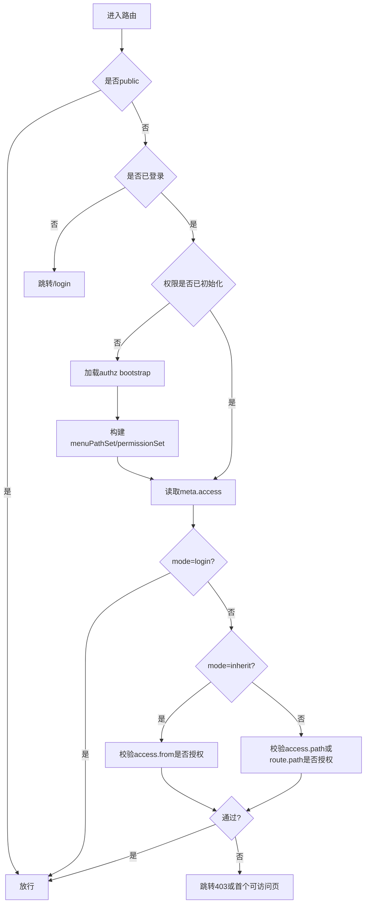

# RBAC 后台管理完整设计（适配 antdv-next admin）

## 1. 目标与范围

### 1.1 目标

构建一套可长期演进的后台权限体系，覆盖：

1. 登录鉴权（Authentication）。
2. 路由访问控制（页面级）。
3. 菜单可见性控制（导航级）。
4. 按钮/操作权限控制（功能级）。
5. API 调用权限控制（接口级，后端强校验）。
6. 数据权限控制（行级/范围级，可选一期后落地）。

### 1.2 设计边界

1. 本设计聚焦后台管理权限体系（RBAC + 数据范围扩展）。
2. 默认单租户；预留多租户字段（tenant_id）扩展位。
3. 前端技术栈遵循当前项目：Vue 3 + Composition API + TypeScript + Pinia + vue-router auto-routes + antdv-next。

---

## 2. 当前项目现状分析

### 2.1 已有能力

1. 已有动态路由注入与守卫骨架（`src/router/guard/auth.ts`）。
2. 已有用户 token 状态存储（`src/stores/user.ts` + `src/composables/authorization.ts`）。
3. 已有菜单数据类型雏形（`src/api/menu/index.ts`，仅基础字段）。
4. 已有多布局与多应用路由能力（`plugins/layout` + `plugins/router.ts`）。
5. 已有菜单权限架构草案文档（`MENU_PERMISSION_ARCHITECTURE.md`）。

### 2.2 主要缺口

1. 缺少完整 RBAC 领域模型（用户-角色-菜单-权限点-API 的关系未闭环）。
2. 前端缺少独立权限 Store，无法统一路由/菜单/按钮权限判定。
3. 后端接口协议尚未定义（登录后一次性获取授权快照、权限版本、失效机制等）。
4. 缺少 RBAC 管理端页面设计（用户、角色、菜单、权限点、数据范围）。
5. API 权限未后端强制校验，存在“只做前端控制”的越权风险。

---

## 3. 权限模型设计

### 3.1 模型选择

采用 **RBAC1 + 约束（RBAC2）+ 数据范围扩展**：

1. RBAC0：用户关联角色，角色授予权限。
2. RBAC1：支持角色继承（可选，建议二期）。
3. RBAC2：支持互斥角色、角色数量上限、禁用态约束。
4. 扩展：角色附带数据范围规则（全部、本部门、本人、自定义组织树）。

### 3.2 统一权限对象

定义统一资源模型（Resource）：

1. `MENU`：菜单/目录（影响导航与页面入口）。
2. `BUTTON`：页面操作点（新增、编辑、删除、导出等）。
3. `API`：后端接口权限点。
4. `DATA_SCOPE`：数据范围规则（绑定角色）。

### 3.3 权限编码规范

建议统一编码：`{app}:{module}:{resource}:{action}`

示例：

1. `admin:user:list:view`
2. `admin:user:item:create`
3. `admin:user:item:update`
4. `admin:user:item:delete`
5. `admin:role:item:assign`
6. `admin:api:/api/admin/user:GET`

约束：

1. 编码全局唯一。
2. 菜单可使用稳定 `menu_code`；按钮/API 使用 `perm_code`。
3. 页面按钮与后端 API 建议一一映射，避免“前后语义漂移”。

### 3.4 路由访问模式（与现有架构对齐）

沿用并固化 `meta.access`：

1. `public`：公开页面，不要求登录。
2. `login`：仅登录可访问，不依赖菜单授权。
3. `menu`：默认模式，要求命中授权菜单路径。
4. `inherit`：继承某菜单权限（详情页、编辑页等隐藏页）。

路由元信息约定：

```ts
interface RouteAccessMeta {
  access?: {
    mode: 'public' | 'login' | 'menu' | 'inherit'
    from?: string // inherit 模式必填
    path?: string // 动态路由的权限锚点
  }
  menu?: boolean // 是否出现在菜单树
  title?: string
}
```

---

## 4. 领域数据结构设计（数据库）

> 建议表名前缀：`sys_`。以下字段类型以 MySQL 8 为例。

### 4.1 用户与角色

#### `sys_user`

| 字段 | 类型 | 说明 |
|---|---|---|
| id | bigint pk | 用户ID |
| username | varchar(64) unique | 登录名 |
| password_hash | varchar(255) | 密码哈希 |
| nickname | varchar(64) | 昵称 |
| email | varchar(128) | 邮箱 |
| phone | varchar(32) | 手机号 |
| status | tinyint | 1启用 0禁用 |
| dept_id | bigint null | 所属部门 |
| is_super_admin | tinyint | 是否超级管理员 |
| last_login_at | datetime null | 最近登录时间 |
| created_at | datetime | 创建时间 |
| updated_at | datetime | 更新时间 |
| deleted_at | datetime null | 软删除 |

索引：`uk_username`、`idx_status`、`idx_dept_id`。

#### `sys_role`

| 字段 | 类型 | 说明 |
|---|---|---|
| id | bigint pk | 角色ID |
| role_key | varchar(64) unique | 角色标识（如 `admin`） |
| role_name | varchar(64) | 角色名称 |
| sort | int | 排序 |
| status | tinyint | 1启用 0禁用 |
| data_scope_type | varchar(32) | `ALL/DEPT/DEPT_AND_CHILD/SELF/CUSTOM` |
| remark | varchar(255) null | 备注 |
| created_at | datetime | 创建时间 |
| updated_at | datetime | 更新时间 |
| deleted_at | datetime null | 软删除 |

#### `sys_user_role`

| 字段 | 类型 | 说明 |
|---|---|---|
| user_id | bigint | 用户ID |
| role_id | bigint | 角色ID |
| created_at | datetime | 创建时间 |

主键：`(user_id, role_id)`。

### 4.2 菜单与权限点

#### `sys_menu`

| 字段 | 类型 | 说明 |
|---|---|---|
| id | bigint pk | 菜单ID |
| app_key | varchar(32) | 应用标识（如 `admin`） |
| parent_id | bigint null | 父菜单ID |
| menu_type | varchar(16) | `CATALOG/MENU/LINK` |
| menu_code | varchar(128) unique | 菜单编码 |
| title | varchar(64) | 菜单名 |
| path | varchar(255) | 路由路径（权限锚点） |
| route_name | varchar(128) null | 路由名称 |
| component | varchar(255) null | 前端组件路径（可选） |
| icon | varchar(64) null | 图标 |
| order_no | int | 排序 |
| hidden | tinyint | 是否隐藏 |
| keep_alive | tinyint | 是否缓存 |
| status | tinyint | 1启用 0禁用 |
| created_at | datetime | 创建时间 |
| updated_at | datetime | 更新时间 |

索引：`idx_app_parent`(`app_key`,`parent_id`)、`idx_path`。

#### `sys_permission`

| 字段 | 类型 | 说明 |
|---|---|---|
| id | bigint pk | 权限点ID |
| app_key | varchar(32) | 应用标识 |
| perm_type | varchar(16) | `BUTTON/API` |
| perm_code | varchar(191) unique | 权限编码 |
| perm_name | varchar(64) | 权限名称 |
| menu_id | bigint null | 关联菜单ID（按钮场景） |
| api_method | varchar(16) null | API Method |
| api_path | varchar(255) null | API Path |
| status | tinyint | 1启用 0禁用 |
| created_at | datetime | 创建时间 |
| updated_at | datetime | 更新时间 |

索引：`idx_app_type`(`app_key`,`perm_type`)、`idx_menu_id`。

#### `sys_role_menu`

| 字段 | 类型 | 说明 |
|---|---|---|
| role_id | bigint | 角色ID |
| menu_id | bigint | 菜单ID |
| created_at | datetime | 创建时间 |

主键：`(role_id, menu_id)`。

#### `sys_role_permission`

| 字段 | 类型 | 说明 |
|---|---|---|
| role_id | bigint | 角色ID |
| permission_id | bigint | 权限点ID |
| created_at | datetime | 创建时间 |

主键：`(role_id, permission_id)`。

### 4.3 数据范围（可一期建表、二期启用）

#### `sys_dept`

部门树（`id`, `parent_id`, `name`, `ancestors`, `status` ...）。

#### `sys_role_data_scope_dept`

| 字段 | 类型 | 说明 |
|---|---|---|
| role_id | bigint | 角色ID |
| dept_id | bigint | 部门ID |

用于 `CUSTOM` 数据范围。

### 4.4 审计与版本

#### `sys_audit_log`

记录登录、授权失败、角色变更、菜单变更、权限变更。

#### `sys_authz_version`

| 字段 | 类型 | 说明 |
|---|---|---|
| app_key | varchar(32) pk | 应用标识 |
| version | bigint | 权限版本号 |
| updated_at | datetime | 更新时间 |

每次角色授权关系变化后 `version + 1`，用于前端缓存失效。

---

## 5. 接口设计（后端）

### 5.1 统一返回结构

```json
{
  "code": 0,
  "msg": "ok",
  "data": {},
  "requestId": "...",
  "timestamp": 1741104000000
}
```

### 5.2 认证接口

1. `POST /api/auth/login`
2. `POST /api/auth/logout`
3. `POST /api/auth/refresh`
4. `GET /api/auth/me`

### 5.3 授权快照接口（登录后关键）

`GET /api/authz/bootstrap?app=admin`

返回：

```json
{
  "user": {
    "id": "1001",
    "username": "admin",
    "nickname": "系统管理员",
    "isSuperAdmin": true
  },
  "roles": ["admin"],
  "authzVersion": 12,
  "menus": [
    {
      "id": "1",
      "parentId": null,
      "app": "admin",
      "title": "系统管理",
      "path": "/system",
      "icon": "setting",
      "order": 1,
      "hidden": false
    },
    {
      "id": "2",
      "parentId": "1",
      "app": "admin",
      "title": "用户管理",
      "path": "/user",
      "icon": "user",
      "order": 10,
      "hidden": false
    }
  ],
  "permissions": [
    "admin:user:list:view",
    "admin:user:item:create",
    "admin:user:item:update",
    "admin:user:item:delete"
  ],
  "apiPermissions": [
    "admin:api:/api/admin/user:GET",
    "admin:api:/api/admin/user:POST"
  ]
}
```

### 5.4 RBAC 管理接口

#### 用户管理

1. `GET /api/admin/users`
2. `POST /api/admin/users`
3. `PUT /api/admin/users/{id}`
4. `PATCH /api/admin/users/{id}/status`
5. `POST /api/admin/users/{id}/roles`
6. `POST /api/admin/users/{id}/reset-password`

#### 角色管理

1. `GET /api/admin/roles`
2. `POST /api/admin/roles`
3. `PUT /api/admin/roles/{id}`
4. `PATCH /api/admin/roles/{id}/status`
5. `POST /api/admin/roles/{id}/menus`
6. `POST /api/admin/roles/{id}/permissions`
7. `POST /api/admin/roles/{id}/data-scope`

#### 菜单管理

1. `GET /api/admin/menus/tree?app=admin`
2. `POST /api/admin/menus`
3. `PUT /api/admin/menus/{id}`
4. `DELETE /api/admin/menus/{id}`

#### 权限点管理

1. `GET /api/admin/permissions`
2. `POST /api/admin/permissions`
3. `PUT /api/admin/permissions/{id}`
4. `DELETE /api/admin/permissions/{id}`

#### 审计

1. `GET /api/admin/audit-logs`

---

## 6. 前端权限接入设计（适配当前仓库）

### 6.1 新增状态模型

建议新增 `permission store`（建议文件：`src/stores/permission.ts`）：

```ts
interface PermissionState {
  initialized: boolean
  appKey: string
  authzVersion: number
  menus: MenuNode[]
  menuPathSet: Set<string>
  permissionSet: Set<string>
  apiPermissionSet: Set<string>
}
```

核心方法：

1. `loadAuthz(appKey)`：拉取 bootstrap 并构建缓存。
2. `hasPermission(code)`：按钮权限判断。
3. `canAccessRoute(to)`：路由权限判断。
4. `clearAuthz()`：登出清理。

### 6.2 路由守卫流程



### 6.3 按钮权限控制

两种并行方式：

1. 组合式函数：`const canCreate = hasPermission('admin:user:item:create')`。
2. 指令：`v-permission="'admin:user:item:create'"`。

说明：

1. 前端只负责显示层和交互层屏蔽。
2. 后端 API 必须再次校验用户是否拥有对应权限。

### 6.4 菜单构建策略

1. 后端返回菜单树为主。
2. 前端用 `router.getRoutes()` 做存在性校验与回填。
3. 不存在的菜单路由：可标记异常并过滤，避免死链接。
4. `hidden=true` 仅影响导航显示，不影响权限判定。

---

## 7. RBAC 后台管理页面设计

> 建议一级菜单：`系统管理`，二级菜单包含：用户管理、角色管理、菜单管理、权限点管理、审计日志。

### 7.1 用户管理页

列表字段：

1. 用户ID
2. 用户名
3. 昵称
4. 手机号/邮箱
5. 所属部门
6. 状态
7. 最近登录时间
8. 创建时间
9. 操作

操作：

1. 新建用户
2. 编辑用户
3. 启用/禁用
4. 分配角色（抽屉 + 多选）
5. 重置密码
6. 批量导出（有权限时显示）

### 7.2 角色管理页

列表字段：

1. 角色ID
2. 角色标识（role_key）
3. 角色名称
4. 数据范围类型
5. 状态
6. 排序
7. 操作

操作：

1. 新建角色
2. 编辑角色
3. 分配菜单（树选择）
4. 分配权限点（按模块分组穿梭框）
5. 配置数据范围（全部/本部门/本人/自定义）
6. 删除角色（需校验是否有绑定用户）

### 7.3 菜单管理页

形态：树表（Tree Table）。

字段：

1. 菜单名称
2. 类型（目录/菜单/外链）
3. 路径
4. 图标
5. 排序
6. 隐藏
7. 状态
8. 操作

规则：

1. 目录可有子节点；菜单节点必须指向可访问路由或外链。
2. 删除节点前需确认无子节点与角色绑定，或采用逻辑删除并同步失效。

### 7.4 权限点管理页

字段：

1. 权限名称
2. 权限编码
3. 类型（按钮/API）
4. 关联菜单
5. API Method/Path（API 类型）
6. 状态
7. 操作

规则：

1. 权限编码唯一。
2. API 类型权限建议由接口注册自动生成，页面仅做启停和说明维护。

### 7.5 审计日志页

字段：

1. 操作人
2. 操作类型（新增/修改/删除/授权/登录等）
3. 目标对象
4. 请求路径
5. 请求IP
6. 结果
7. 时间

支持：按时间范围、操作人、操作类型筛选。

---

## 8. 安全设计与一致性策略

### 8.1 安全基线

1. 前端权限永远不作为最终裁决依据。
2. 所有敏感 API 统一走后端鉴权中间件。
3. 超级管理员仅后端保留兜底，前端不硬编码超级权限。
4. 登录 token 采用短期 access token + refresh token 机制。
5. 密码仅存哈希（Argon2/Bcrypt），禁止明文与可逆加密。

### 8.2 权限变更一致性

1. 角色/菜单/权限关系变更后，`authzVersion + 1`。
2. 前端每次进入受保护路由时对比版本；版本变化自动重载授权快照。
3. 可配合 WebSocket/SSE 做主动踢出或强制刷新权限。

### 8.3 关键防护

1. 防越权：接口按 `perm_code` 校验。
2. 防水平越权：资源归属校验（如用户只能改自己可管理范围内账号）。
3. 防误删：关键删除操作二次确认 + 审计日志 + 可恢复策略。
4. 防并发覆盖：角色/菜单编辑启用 `updated_at` 乐观锁校验。

---

## 9. 分阶段实施计划

### 阶段 A（基础可用）

1. 建表与初始化脚本（用户、角色、菜单、权限点、关联表）。
2. 登录与 `authz/bootstrap` 接口落地。
3. 前端 permission store + 路由守卫接入。
4. 菜单渲染改为后端驱动。

交付标准：已登录用户可按角色看到不同菜单并控制页面访问。

### 阶段 B（完整 RBAC 管理）

1. 用户管理页 + 角色分配。
2. 角色管理页 + 菜单/权限点授权。
3. 菜单管理页 + 权限点管理页。
4. 关键操作审计日志。

交付标准：平台管理员可以在线维护 RBAC 数据并实时生效。

### 阶段 C（增强能力）

1. 数据范围权限启用。
2. API 权限自动注册/扫描。
3. 权限版本主动推送与会话策略优化。

交付标准：实现数据级隔离与大规模权限变更稳定性。

---

## 10. 验收与测试清单

### 10.1 功能验收

1. 未登录访问受保护页面会跳转登录。
2. 登录后仅可访问授权菜单及继承页面。
3. 未授权按钮不显示或不可用。
4. 后端 API 对未授权调用返回 403。
5. 角色变更后用户刷新或重进页面权限立即生效。

### 10.2 边界场景

1. 菜单路径配置错误时前端不崩溃并给出告警。
2. 动态路由（如 `/test/:form/:id`）通过 `access.path` 或 `inherit` 正常鉴权。
3. 用户被禁用后 token 立即失效或下一次请求失效。
4. 角色被删除且仍绑定用户时，系统有防护策略（阻止删除或自动解绑）。

### 10.3 安全验收

1. 越权调用敏感 API 全部被拒绝。
2. 审计日志可追溯关键授权操作。
3. 关键表不存在无索引全表扫描瓶颈（至少完成核心索引检查）。

---

## 11. 初始化建议（首批角色与权限）

### 11.1 角色

1. `super_admin`：系统超级管理员。
2. `platform_admin`：平台管理员。
3. `auditor`：审计只读角色。
4. `operator`：运营角色（有限写权限）。

### 11.2 首批菜单

1. `/home` 首页。
2. `/user` 用户管理。
3. `/role` 角色管理。
4. `/menu` 菜单管理。
5. `/permission` 权限点管理。
6. `/audit-log` 审计日志。

### 11.3 首批权限点

1. 用户：`list/create/update/delete/assign-role/reset-password`。
2. 角色：`list/create/update/delete/assign-menu/assign-permission/assign-data-scope`。
3. 菜单：`list/create/update/delete`。
4. 权限点：`list/create/update/delete`。
5. 审计：`list/export`。

---

## 12. 结论

本方案在你当前项目结构上可直接落地，关键是先完成“授权快照 + 前端统一权限状态 + 后端强校验”三件事。这样可以快速实现可用 RBAC，再通过数据范围与审计增强逐步演进到企业级权限系统。
